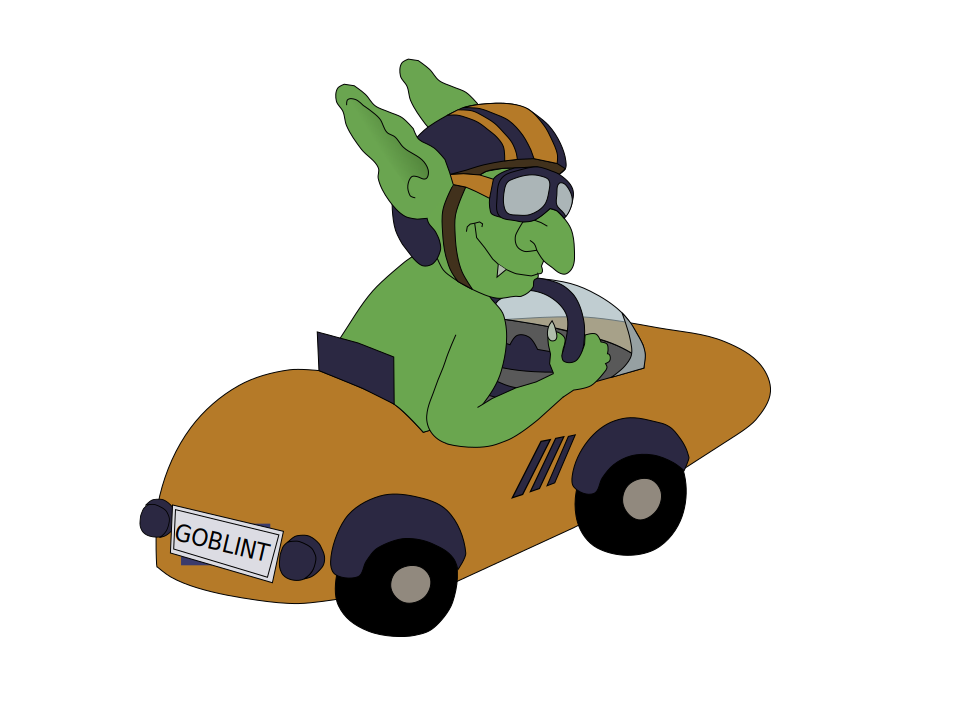

# Goblint documentation

Welcome to the Goblint project documentation! Here you may find *some* useful information about using and developing Goblint. 

Below is a picture of *Wettlaufweltmeister*, the Goblint organization mascot. The ranking of verifiers in the Race Detection category at SV-COMP 2023 explains the name.

1. **Goblint (1342)**
1. Deagle (1199)
1. UAutomizer (880)
1. UGemCutter (785)
1. UTaipan (745)
1. Dartagnan (704)
1. CPAchecker (454)
1. PeSCo (454)
1. Theta (205)
1. Locksmith (234)
1. ...